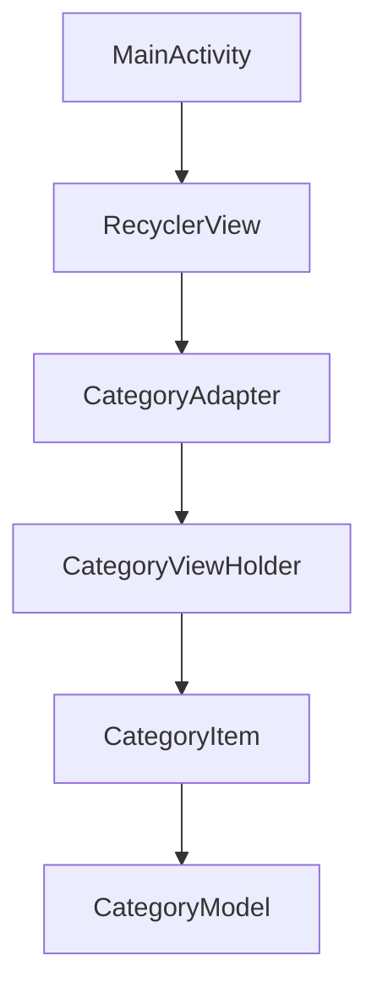
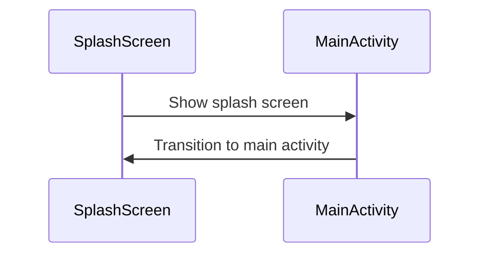
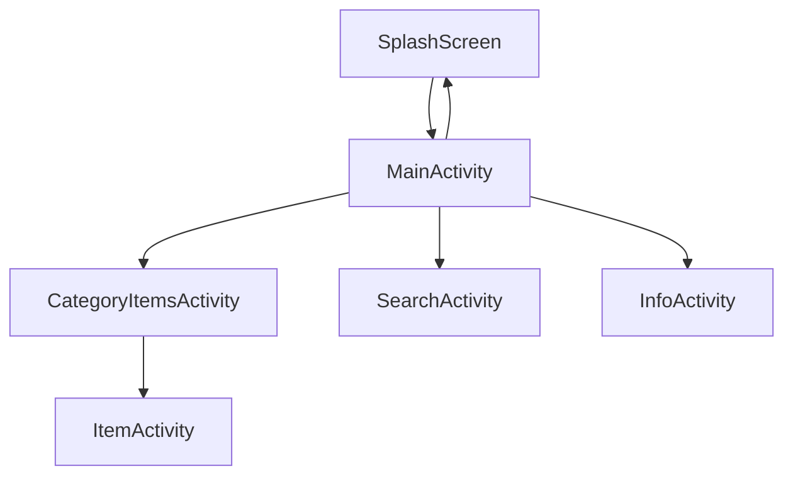

<br />
<div align="center">
  <a href="https://github.com/EmranHejazi/lar_android_application">
    
  </a>

  <h3 align="center">LAR APPLICATION</h3>

  <p align="center">
    An Android application dedicated to showcasing the city of Lar, Iran.
</div>

# Welcome

Welcome to the Lar App! This application provides detailed information about the beautiful city of Lar, located in Fars Province, Iran. Whether you're a local or planning to visit, the Lar app offers essential information about the city's history, attractions, and other points of interest.

## Table of Contents

1. [Introduction](#introduction)
2. [Features](#features)
3. [How to Use](#how-to-use)
4. [Project Structure](#project-structure)
5. [Technical Details](#technical-details)
6. [Contributing](#contributing)
7. [License](#license)

## Introduction

Lar App is an Android application designed to give users insight into the city of Lar. From historical landmarks to local businesses and cultural spots, the app offers a comprehensive guide to everything Lar has to offer. It’s a perfect tool for both locals and visitors who want to explore the city in-depth.

## Features

- **City Categories**: Browse through various categories that highlight the city's landmarks, restaurants, and cultural spots.
- **City Info**: View detailed information about Lar's history, culture, and key locations.
- **Search Functionality**: Easily find specific locations and categories using the search feature.
- **User-Friendly Interface**: Navigate through the app with ease using a clean and simple design.
- **Map Integration**: Explore Lar’s locations with embedded map support for easy navigation.

## How to Use

To use Lar App, follow these simple steps:

1. **Installation**: Download and install Android Studio with the required SDK version.
2. **Launching**: Build the project and launch the application either in an emulator or on a real Android device.
3. **Exploration**: Upon opening the app, you’ll be welcomed with a splash screen, followed by the main screen with options to explore various categories of Lar city.
4. **Navigating Categories**: Browse categories like landmarks, restaurants, and more to discover all the city has to offer.
5. **Search**: Use the search functionality to quickly find specific items in Lar.
6. **Details**: Tap on any item to view more details, such as history, location, and contact information.

### Requirements

- Android device running Android 7.0 (Nougat) or above.
- Minimum SDK version: 27
- Target SDK version: 34

## Project Structure

The project structure is organized as follows:

```plaintext
lar/
|-- app/
|   |-- src/
|       |-- main/
|           |-- java/
|               |-- app.emran.lar/
|                   |-- activities/
|                   |-- adapters/
|                   |-- data/
|                   |-- models/
|           |-- res/
|               |-- layout/
|               |-- values/
|               |-- drawable/
|               |-- ...
|-- build.gradle
|-- AndroidManifest.xml
|-- README.md


- **activities**: Contains all activity classes responsible for various screens in the app.
- **adapters**: Houses RecyclerView adapters for displaying data.
- **data**: Holds data-related classes such as constants and data models.
- **models**: Contains POJO (Plain Old Java Object) classes representing data entities.
- **layout**: XML layout files for defining the UI of each screen.
- **values**: Resource files including strings, colors, and dimensions.

## Technical Details

### Architecture

Lar App follows the Model-View-ViewModel (MVVM) architecture pattern to ensure a well-structured and maintainable codebase.

### RecyclerView

The app utilizes a RecyclerView in the MainActivity to display a list of categories, with each category containing different locations or items of interest in Lar.



#### RecyclerView Functionality

The RecyclerView works as follows:

| Step        | Description                                                |
|-------------|------------------------------------------------------------|
| 1. Populate | The RecyclerView is populated with different city categories. |
| 2. Display  | Categories are displayed in a grid or list view.           |
| 3. Interaction | Tap on any category to explore the details of locations or items. |

### Splash Screen

A splash screen is shown when the app is launched, giving users a smooth transition to the main app screen.



### Activity Diagram

This diagram illustrates the activities and their relationships in the Lar App:



### SharedPreferences

SharedPreferences is used in Lar App to store user preferences such as theme settings or the last viewed item. This ensures a personalized experience for every user.

## Contributing

We welcome contributions to improve the Lar App! If you’d like to contribute, please follow these steps:

1. Fork the repository.
2. Create a new branch for your feature or bug fix.
3. Make your changes and submit a pull request.

## License

Lar App is licensed under the MIT License. See the [LICENSE](LICENSE) file for more details.

---

Thank you for choosing Lar App! We hope this app enhances your exploration of Lar city. For any questions or feedback, feel free to reach out to us.

**© All rights reserved by Emran Hejazi Summer 2023**
